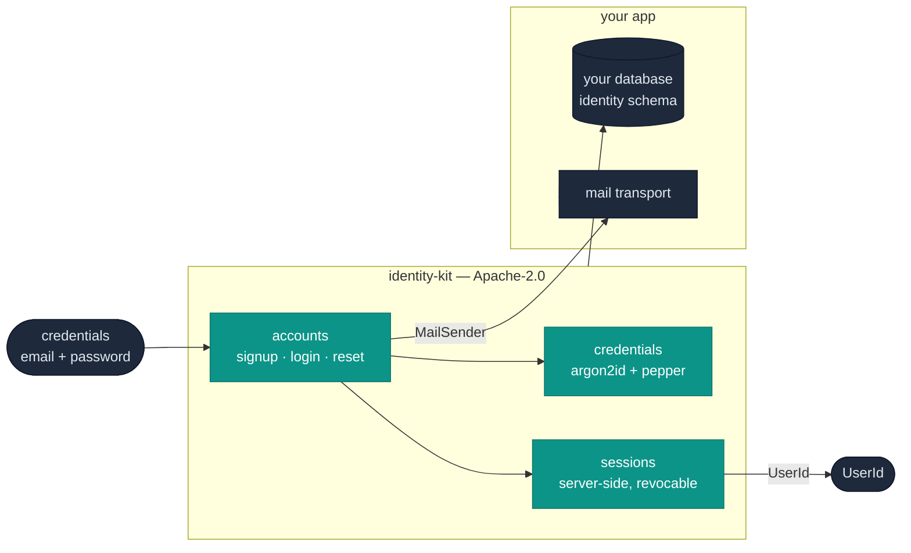
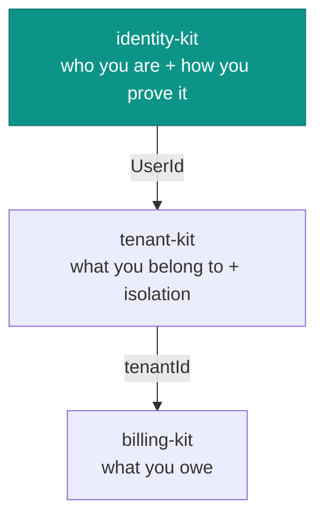

# identity-kit

User identity and authentication as a library, for the app you already run.



identity-kit owns the teal boxes: what a user **is**, how they **prove it**
(argon2id credentials, server-side sessions), and the account lifecycle around
that — signup, email verification, password reset, deletion. It produces a
`UserId` and stops there. Your app owns the database it writes to (through a
narrow executor) and the transport its mail goes out on (through a seam).

Apache-2.0, sibling to [tenant-kit](http://localhost:3003/brett/tenant-kit) and
[billing-kit](http://localhost:3003/brett/billing-kit): same executor interface,
same design rules, same "library not platform" stance.

## Where it sits in the family

tenant-kit's own README says *"your app owns everything else — its users, its
auth"*. That is the seam this fills. The three libraries layer, each consuming
the one below:



A `UserId` minted here is the `userId` in a tenant-kit membership and, through
the tenant, the subject a billing-kit charge lands on. identity-kit has no
opinion about tenancy, roles or money — those are the other libraries'.

## The problem it solves

Authentication usually arrives in one of two shapes, and both put your user
model somewhere you don't control:

- **A hosted platform** — Clerk, Auth0, WorkOS — that owns your user model and
  bills per active user.
- **A service you deploy** — Ory, Keycloak, SuperTokens — that you run and
  operate as a separate system with its own database and API.

identity-kit is a third shape: **a library you embed.** Accounts, credentials
and sessions compile into the app you already run, over the Postgres you already
have. No per-user fee, no second service.

It is **not** a full identity platform, and does not try to be. OAuth/SSO/SAML
provider flows are deliberately out of scope — that is where a hosted platform
earns its keep. This is the password/session/credential core, done carefully,
with clean seams.

## Quickstart

```ts
import { createIdentity } from 'identity-kit';

const identity = createIdentity({
  db,                                   // any SqlExecutor (a pg.Pool adapter is ~15 lines)
  mail: { send: (m) => myTransport(m) }, // you own the relay; the library writes the body
  config: {
    pepper: process.env.AUTH_PEPPER!,   // an HMAC key kept OUT of the database
    pepperVersion: 1,
    appUrl: 'https://app.example.com',
    cookieSecure: true,
  },
});

await identity.signup({ email, password });     // emails a verification link
await identity.verifyEmail(token);              // verifies — does NOT sign in
const result = await identity.login({ email, password });
if (result.kind === 'session') setCookie(identity.sessionCookie(result.token, result.expiresAt));
```

Apply the schema first: `psql -f node_modules/identity-kit/sql/001_identity.sql`.

## What it does carefully

Auth correctness is adversarial, not deterministic — you cannot unit-test your
way to "secure" — so the reasoning is in the code. The load-bearing parts:

- **Passwords** are argon2id (RFC 9106), peppered with an HMAC key the database
  never holds, so a stolen backup is not offline-crackable. `needsRehash`
  upgrades stored hashes on next login, so raising cost later forces no resets.
- **Signup and reset are enumeration-safe.** The same response, the same work
  (argon2 runs on both branches), and an email on both branches, whether or not
  the address exists — so neither the status code nor the timing reveals who has
  an account.
- **Sessions are server-side rows**, so revocation is a `DELETE` that takes
  effect on the next request. A password change or reset revokes every session;
  the row carries identity, never entitlement.
- **Reset tokens are burned on any use**, success or failure, in the same
  transaction as the password write — no replay out of a mail archive, no window
  left live by a recognised-failures-only rule.
- **Lockout is exponential backoff, not a hard lock** — a hard per-account lock
  is a denial-of-service anyone who knows an address can point at its owner.

## What it delegates

- **Mail transport** — the `MailSender` seam. The library composes every message
  (their shape is a security property); the host picks the relay.
- **OAuth / SSO / SAML, MFA, API keys** — out of the core. MFA and API keys are
  planned as separate opt-in entry points (`identity-kit/mfa`, `.../apikeys`),
  the same way billing-kit splits metering from providers.
- **HTTP** — no endpoints, no framework. `login` is a function; how it is routed
  and CSRF-protected is the host's. (Cookie helpers are provided, config-driven,
  and entirely optional.)

## Schema

Everything lives in an `identity` schema so it cannot collide with a host
application's `users` table. `sql/001_identity.sql` declares `users`, `sessions`,
`email_verification_tokens` and `password_reset_tokens`, with cascade-on-delete
and the indexes the queries need.

## Development

```sh
pnpm install
pnpm typecheck
createdb identity_kit_test   # the tests exercise real SQL; they skip without a DB
pnpm test
```

The tests assert the security properties against a real Postgres — the token
burned in the same transaction as the write, the unique constraint on email, the
cascade — because that behaviour is in the database, not the TypeScript.

## Licence

Apache-2.0. See `LICENSE` and `NOTICE`. Ported from an internal implementation
(ai_member_cloud) to a provider-agnostic library; the security design is
preserved.
